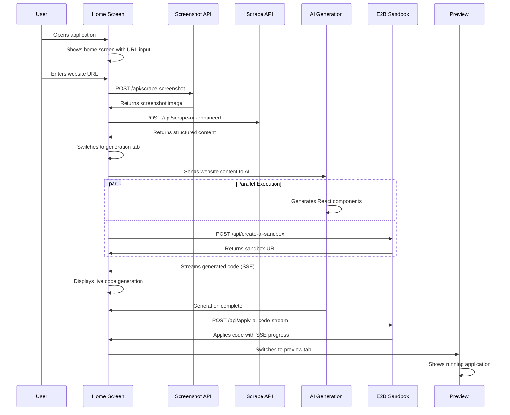
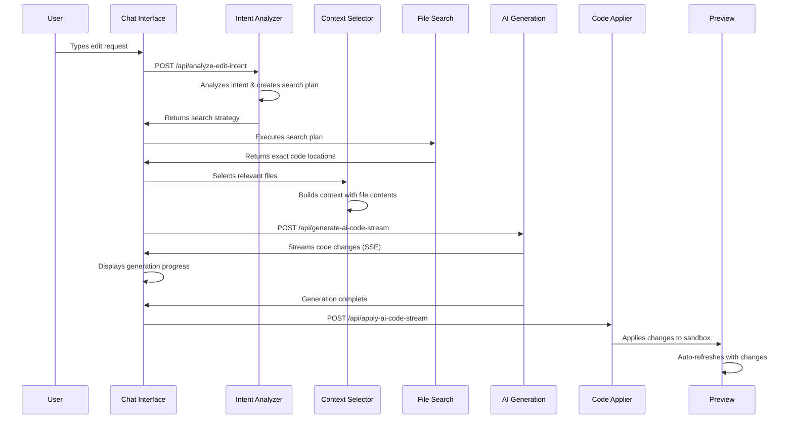
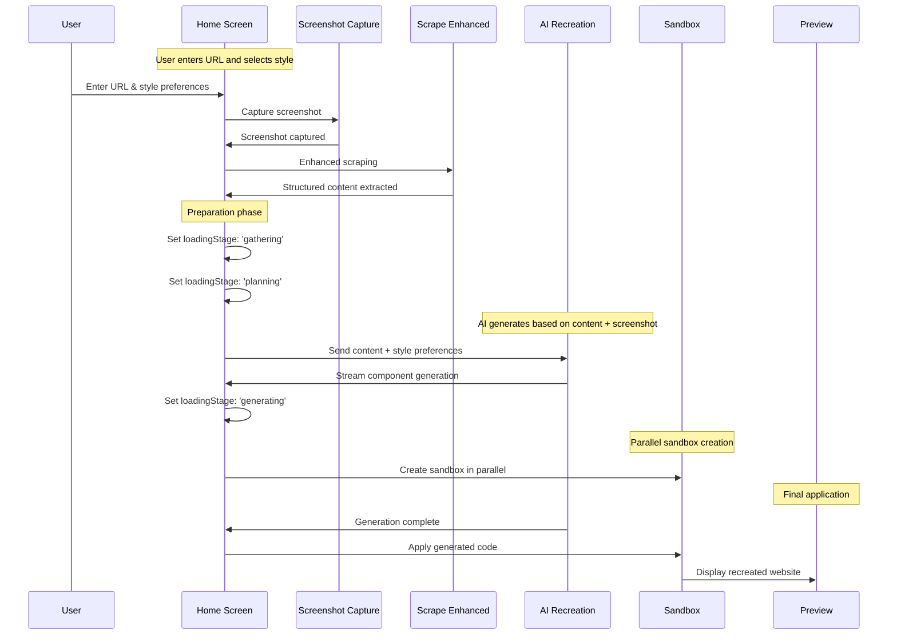
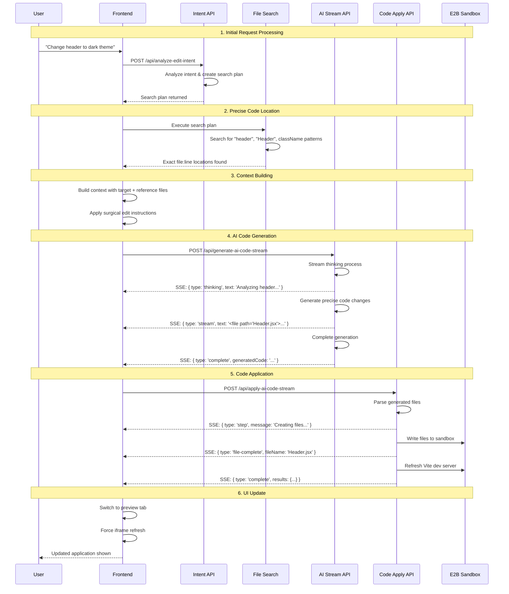
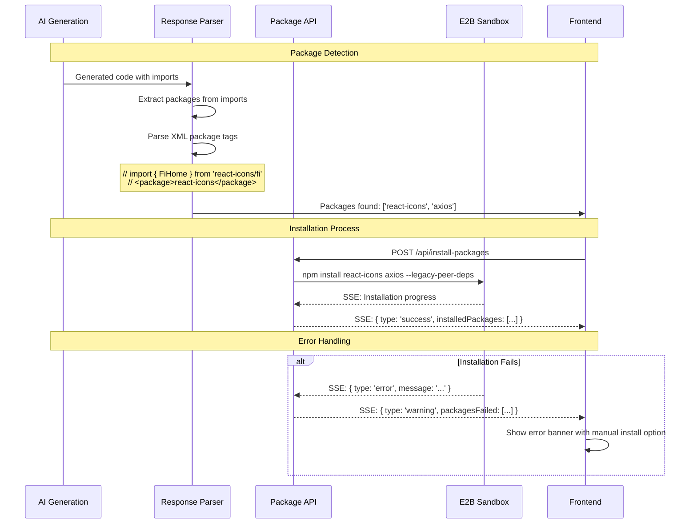

# PROMPT_ARCHITECTURE.md

This document provides a comprehensive overview of the prompt architecture, user interaction flows, and AI integration patterns in the Open Lovable AI Code Generation Platform.

## Table of Contents

- [Architecture Overview](#architecture-overview)
- [User Interaction Flows](#user-interaction-flows)
- [Prompt Engineering Patterns](#prompt-engineering-patterns)
- [Streaming Architecture](#streaming-architecture)
- [Sequence Diagrams](#sequence-diagrams)
- [State Management](#state-management)
- [AI Model Integration](#ai-model-integration)
- [Context Management](#context-management)

## Architecture Overview

The platform implements a sophisticated multi-layered prompt architecture designed for real-time AI-powered code generation with comprehensive context awareness.

```
┌─────────────────────────────────────────────────────────────┐
│                     USER INTERFACE LAYER                   │
├─────────────────────────────────────────────────────────────┤
│ • Home Screen (Website Cloning)                            │
│ • Chat Interface (AI Conversations)                        │
│ • Preview Tab (Sandbox Iframe)                             │
│ • Generation Tab (Live Code Streaming)                     │
└─────────────────────────────────────────────────────────────┘
                                │
                                ▼
┌─────────────────────────────────────────────────────────────┐
│                 PROMPT PROCESSING LAYER                    │
├─────────────────────────────────────────────────────────────┤
│ • Intent Analysis (lib/edit-intent-analyzer.ts)            │
│ • Context Selection (lib/context-selector.ts)              │
│ • File Search Execution (lib/file-search-executor.ts)      │
│ • Conversation Context Management                          │
└─────────────────────────────────────────────────────────────┘
                                │
                                ▼
┌─────────────────────────────────────────────────────────────┐
│                   AI INTEGRATION LAYER                     │
├─────────────────────────────────────────────────────────────┤
│ • OpenAI/GPT Integration                                    │
│ • Anthropic/Claude Integration                              │
│ • Google/Gemini Integration                                 │
│ • Groq/Moonshot Integration                                 │
│ • Streaming Response Processing                             │
└─────────────────────────────────────────────────────────────┘
                                │
                                ▼
┌─────────────────────────────────────────────────────────────┐
│                  CODE EXECUTION LAYER                      │
├─────────────────────────────────────────────────────────────┤
│ • E2B Sandbox Management                                    │
│ • Package Installation & Management                        │
│ • File System Operations                                   │
│ • Vite Development Server Management                       │
└─────────────────────────────────────────────────────────────┘
```

## User Interaction Flows

### 1. Initial App Creation Flow



### 2. Iterative Edit Flow



### 3. Website Cloning Flow



## Prompt Engineering Patterns

### 1. Context-Aware System Prompts

The platform uses sophisticated prompt engineering with multiple layers of context:

**Base System Prompt Structure:**
```typescript
// From lib/context-selector.ts:buildSystemPrompt()
{
  editExamples: getEditExamplesPrompt(),      // Surgical edit patterns
  editIntent: analyzeEditIntent(),            // Intent analysis results  
  fileStructure: buildFileStructureSection(), // Complete file overview
  componentPatterns: getComponentPatternPrompt(), // Existing patterns
  filesToEdit: primaryFiles,                  // Target files only
  contextFiles: contextFiles,                 // Reference files
  editInstructions: buildEditInstructions(),  // Type-specific rules
  componentRelationships: buildComponentRelationships() // Import/usage graph
}
```

**Surgical Edit Instructions (UPDATE_COMPONENT):**
```markdown
## SURGICAL EDIT INSTRUCTIONS
- You MUST preserve 99% of the original code
- ONLY edit the specific component(s) mentioned  
- Make ONLY the minimal change requested
- DO NOT rewrite or refactor unless explicitly asked
- DO NOT remove any existing code unless explicitly asked
- DO NOT change formatting or structure
- Preserve all imports and exports
- Return the COMPLETE file with the surgical change applied
- Think of yourself as a surgeon making a precise incision
```

### 2. Intent-Based Prompt Routing

**Edit Types & Patterns:**
```typescript
// From lib/edit-intent-analyzer.ts
const intentPatterns = {
  UPDATE_COMPONENT: [
    /update\s+(the\s+)?(\w+)\s+(component|section|page)/i,
    /change\s+(the\s+)?(\w+)/i,
    /modify\s+(the\s+)?(\w+)/i,
    /fix\s+(the\s+)?(\w+)\s+(styling|style|css|layout)/i
  ],
  ADD_FEATURE: [
    /add\s+(a\s+)?new\s+(\w+)\s+(page|section|feature|component)/i,
    /create\s+(a\s+)?(\w+)\s+(page|section|feature|component)/i
  ],
  REMOVE_ELEMENT: [
    /remove\s+.*\s+(button|link|text|element|section)/i,
    /delete\s+.*\s+(button|link|text|element|section)/i
  ]
}
```

### 3. Agentic Search Planning

**AI-Generated Search Strategy:**
```typescript
// From app/api/analyze-edit-intent/route.ts
const searchPlan = await generateObject({
  schema: {
    editType: 'UPDATE_COMPONENT' | 'ADD_FEATURE' | 'REMOVE_ELEMENT',
    reasoning: string,      // AI explains its search strategy
    searchTerms: string[],  // Exact text to find (case-insensitive)
    regexPatterns: string[], // Code structure patterns
    expectedMatches: number, // Validation helper
    fallbackSearch: {       // Backup if primary fails
      terms: string[],
      patterns: string[]
    }
  }
});
```

## Streaming Architecture

### Server-Sent Events (SSE) Implementation

The platform uses sophisticated streaming for real-time user feedback:

```typescript
// From app/api/generate-ai-code-stream/route.ts
const stream = new TransformStream();
const writer = stream.writable.getWriter();

const sendProgress = async (data: any) => {
  const message = `data: ${JSON.stringify(data)}\n\n`;
  await writer.write(encoder.encode(message));
};

// Stream types:
sendProgress({ type: 'thinking', text: '...' });          // AI thinking
sendProgress({ type: 'conversation', text: '...' });      // Chat text
sendProgress({ type: 'stream', raw: true, text: '...' }); // Raw code
sendProgress({ type: 'component', name: '...' });         // Component done
sendProgress({ type: 'complete', generatedCode: '...' }); // Final result
```

### Live Code Parsing

Real-time file extraction from streamed responses:

```typescript
// From app/page.tsx:1610-1689
const fileRegex = /<file path="([^"]+)">([^]*?)<\/file>/g;
let match;
const processedFiles = new Set();

while ((match = fileRegex.exec(streamedCode)) !== null) {
  const filePath = match[1];
  const fileContent = match[2];
  
  if (!processedFiles.has(filePath)) {
    // Add to generation progress for live display
    setGenerationProgress(prev => ({
      ...prev,
      files: [...prev.files, {
        path: filePath,
        content: fileContent.trim(),
        type: getFileType(filePath),
        completed: true
      }]
    }));
  }
}
```

### Code Application Streaming

```typescript  
// From app/api/apply-ai-code-stream/route.ts
const progressTypes = {
  'start': 'Starting code application...',
  'step': 'Installing packages / Creating files...',
  'package-progress': 'Package installation progress...',
  'file-progress': 'File creation progress...',
  'command-progress': 'Command execution...',
  'complete': 'Application complete'
};
```

## Sequence Diagrams

### Complete AI Generation Pipeline



### Package Detection & Installation Flow



## State Management

### Conversation Context Management

```typescript
// From app/page.tsx:89-101
const [conversationContext, setConversationContext] = useState({
  scrapedWebsites: Array<{ url: string; content: any; timestamp: Date }>,
  generatedComponents: Array<{ name: string; path: string; content: string }>,
  appliedCode: Array<{ files: string[]; timestamp: Date }>, // Edit detection
  currentProject: string,
  lastGeneratedCode: string | undefined
});

// Edit mode detection
const isEdit = conversationContext.appliedCode.length > 0;
```

### Generation Progress State

```typescript
// From app/page.tsx:111-135
const [generationProgress, setGenerationProgress] = useState({
  isGenerating: boolean,        // Currently generating
  status: string,              // Status message
  components: Array<{          // Component progress
    name: string; 
    path: string; 
    completed: boolean 
  }>,
  currentComponent: number,    // Current index
  streamedCode: string,        // Raw streamed content
  isStreaming: boolean,        // Actively streaming
  isThinking: boolean,         // AI thinking phase
  thinkingText: string,        // Thinking content
  thinkingDuration: number,    // Thinking time
  currentFile: {               // File being generated
    path: string; 
    content: string; 
    type: string 
  },
  files: Array<{               // Completed files
    path: string; 
    content: string; 
    type: string; 
    completed: boolean;
    edited?: boolean           // Edited in this session
  }>,
  lastProcessedPosition: number, // Stream parsing position
  isEdit: boolean              // Edit vs new generation
});
```

### File Manifest & Context

```typescript  
// From types/file-manifest.ts
interface FileManifest {
  entryPoint: string,              // App.jsx
  files: Record<string, {          // All project files
    type: 'component' | 'page' | 'style' | 'config',
    content: string,
    lastModified: number,
    imports: string[],
    componentInfo?: {
      name: string,
      childComponents: string[]
    }
  }>,
  componentTree: Record<string, {  // Import relationships
    imports: string[],
    importedBy: string[]
  }>,
  routes: Array<{                  // Routing info
    path: string,
    component: string
  }>,
  styleFiles: string[]             // CSS files
}
```

## AI Model Integration

### Multi-Provider Support

```typescript
// From app/api/analyze-edit-intent/route.ts:96-111
const modelRouting = {
  'anthropic/*': anthropic(model.replace('anthropic/', '')),
  'openai/gpt-oss*': groq(model),                    // Groq for OSS models
  'openai/*': openai(model.replace('openai/', '')),
  'google/*': createGoogleGenerativeAI(model.replace('google/', '')),
  'default': groq(model)                             // Fallback to Groq
};
```

### Model Configuration

```typescript
// From config/app.config.ts:18-28
ai: {
  defaultModel: 'moonshotai/kimi-k2-instruct',
  availableModels: [
    'openai/gpt-4o-2024-08-06',
    'anthropic/claude-3-5-sonnet-20241022', 
    'google/gemini-2.0-flash-exp',
    'groq/llama-3.3-70b-versatile',
    'moonshotai/kimi-k2-instruct'
  ],
  maxTokens: 8192,
  temperature: 0.3
}
```

## Custom System Prompts & Templates

The application makes extensive use of custom system prompts and templating systems to guide AI behavior. These are dynamically constructed based on context and user intent.

### 1. Edit Examples Template System

**Location:** `lib/edit-examples.ts`

The platform includes a comprehensive template system with 9+ detailed examples showing correct vs incorrect editing approaches:

```typescript
export const EDIT_EXAMPLES = `
## Edit Strategy Examples

### Example 1: Update Header Color
USER: "Make the header background black"

CORRECT APPROACH:
1. Identify Header component location
2. Edit ONLY Header.jsx
3. Change background color class/style

INCORRECT APPROACH:
- Regenerating entire App.jsx
- Creating new Header.jsx from scratch
- Modifying unrelated files
`;
```

**Key Template Features:**
- **Surgical Edit Examples:** Shows precise, minimal changes
- **Violation Examples:** Explicitly shows what NOT to do
- **Expected Output Format:** Demonstrates proper `<file>` tag usage
- **Intent Classification:** Maps user requests to edit types

### 2. Dynamic System Prompt Construction

**Location:** `app/api/generate-ai-code-stream/route.ts:554-799`

The main system prompt is dynamically constructed with multiple sections:

```typescript
const systemPrompt = `You are an expert React developer with perfect memory...
${conversationContext}

🚨 CRITICAL RULES - YOUR MOST IMPORTANT INSTRUCTIONS:
1. **DO EXACTLY WHAT IS ASKED - NOTHING MORE, NOTHING LESS**
2. **CHECK App.jsx FIRST** - ALWAYS see what components exist
3. **NAVIGATION LIVES IN Header.jsx** - Don't create Nav.jsx if Header exists
4. **USE STANDARD TAILWIND CLASSES ONLY**
5. **FILE COUNT LIMITS**: Simple change = 1 file ONLY

${isEdit ? EDIT_MODE_RULES : NEW_GENERATION_RULES}

${editContext ? TARGETED_EDIT_MODE_RULES : ''}
`;
```

### 3. Context-Aware Prompt Templates

**Edit Mode Detection & Rules:**
```typescript
// Different system prompts based on mode
if (isEdit) {
  // Surgical edit rules - 800+ lines of detailed instructions
  const editRules = `
  CRITICAL: THIS IS AN EDIT TO AN EXISTING APPLICATION
  1. DO NOT regenerate the entire application
  2. DO NOT create files that already exist
  3. ONLY edit the EXACT files needed
  4. NEVER create config files (they exist)
  5. Count the files - ONE request = ONE file typically
  `;
}
```

**Targeted Edit Mode (with Agentic Search):**
```typescript
if (editContext) {
  const surgicalPrompt = `
  TARGETED EDIT MODE ACTIVE
  - Edit Type: ${editContext.editIntent.type}
  - Files to Edit: ${editContext.primaryFiles.join(', ')}
  
  🚨 YOU MUST ***ONLY*** GENERATE THE FILES LISTED ABOVE!
  VIOLATION WILL RESULT IN FAILURE
  `;
}
```

### 4. Specialized Prompt Templates

**Component Pattern Prompt (`lib/edit-examples.ts:232-252`):**
```typescript
export function getComponentPatternPrompt(fileStructure: string): string {
  return `
  ## Current Project Structure
  ${fileStructure}
  
  ## Component Naming Patterns
  Based on your file structure, here are the patterns to follow:
  1. Component files are in: src/components/
  2. When user mentions "header" → look for Header.jsx
  3. When user mentions "nav" → could be Navigation.jsx, Header.jsx
  `;
}
```

**Agentic Search Prompt (for Intent Analysis):**
```typescript
// From app/api/analyze-edit-intent/route.ts:122-149
const searchPlanPrompt = `
You are an expert at planning code searches. 

SEARCH STRATEGY RULES:
1. For text changes: Search for EXACT text "Start Deploying"
2. For style changes: Search for component names, className patterns
3. For removing elements: Search for button text or aria-labels
4. Be SPECIFIC: Use exact capitalization, multiple terms

Current project: ${fileSummary}
User request: "${prompt}"
`;
```

### 5. Conversation Context Templates

**Conversation Memory Integration:**
```typescript
// From generate-ai-code-stream/route.ts:489-550
let conversationContext = `
## Conversation History (Recent)

### Recent Edits:
${recentEdits.map(edit => 
  `- "${edit.userRequest}" → ${edit.editType} (${edit.targetFiles.join(', ')})`
)}

### 🚨 RECENTLY CREATED/EDITED FILES (DO NOT RECREATE THESE):
${recentlyCreatedFiles.map(file => `- ${file}`)}

### Recent Messages:
${recentMessages.map(msg => `- "${msg.content.substring(0, 100)}..."`)}

### Recent Changes:
${majorChanges.map(change => `- ${change.description}`)}

### User Preferences:
- Edit style: ${userPrefs.preferredEditStyle}
`;
```

### 6. Comprehensive Rule Templates

**Critical UI/UX Rules (Lines 710-755):**
- 40+ detailed styling rules
- Responsive design requirements
- Tailwind-specific class restrictions
- Animation and transition guidelines

**File Management Rules (Lines 556-678):**
- Component relationship rules
- Package usage guidelines
- File modification constraints
- Website cloning requirements

**Code Quality Rules (Lines 756-799):**
- String escaping requirements
- Quote sanitization rules
- JSX syntax validation
- Code snippet display patterns

### 7. Template Composition Strategy

The system uses a layered approach to build the final prompt:

```
Base System Role
├── Conversation Context (if exists)
├── Critical Rules (always)
├── Edit Mode Rules (if editing)
│   ├── Targeted Edit Rules (if agentic search succeeded)
│   └── Fallback Edit Rules (if agentic search failed)
├── UI/UX Rules (always)
├── Styling Rules (always)
└── Code Quality Rules (always)
```

### 8. Template Customization Points

**Model-Specific Prompts:** Different prompts for different AI providers
**Intent-Based Templates:** Surgical edit vs full generation prompts  
**Context-Aware Sections:** File-specific instructions based on detected components
**Error-Recovery Templates:** Fallback prompts when agentic systems fail

This sophisticated templating system ensures that the AI receives precisely crafted instructions tailored to the specific context, user intent, and conversation history.

## Context Management

### Intelligent File Selection

```typescript
// From lib/context-selector.ts:15-71
export function selectFilesForEdit(userPrompt: string, manifest: FileManifest) {
  // 1. Analyze edit intent
  const editIntent = analyzeEditIntent(userPrompt, manifest);
  
  // 2. Get target files (files to edit)
  const primaryFiles = editIntent.targetFiles;
  
  // 3. Get context files (all others for reference)  
  const allFiles = Object.keys(manifest.files);
  let contextFiles = allFiles.filter(file => !primaryFiles.includes(file));
  
  // 4. Prioritize key architectural files
  const keyFiles = [
    findAppFile(),           // App.jsx - component structure
    findTailwindConfig(),    // Design system
    findIndexCss(),          // Global styles  
    findPackageJson()        // Dependencies
  ].filter(f => f && !primaryFiles.includes(f));
  
  // 5. Build enhanced system prompt with context
  const systemPrompt = buildSystemPrompt(userPrompt, editIntent, primaryFiles, contextFiles, manifest);
  
  return { primaryFiles, contextFiles, systemPrompt, editIntent };
}
```

### Conversation Memory

```typescript
// Global conversation state management
declare global {
  var conversationState: ConversationState | null;
  var activeSandbox: any;
  var existingFiles: Set<string>;
  var sandboxState: SandboxState;
}

// Persistent context across API calls
const conversationState = {
  context: {
    messages: Array<{ role: string; content: string; metadata?: any }>,
    projectEvolution: {
      majorChanges: Array<{
        timestamp: number;
        description: string; 
        filesAffected: string[]
      }>
    }
  },
  lastUpdated: number
};
```

## Error Handling & Recovery

### Graceful Degradation Patterns

1. **Package Installation Failures:**
   - Continue with file creation if packages fail
   - Show user-friendly error messages
   - Provide manual installation instructions

2. **Sandbox Reconnection:**
   - Attempt to reconnect to existing sandbox
   - Fall back to creating new sandbox
   - Preserve conversation context

3. **Streaming Interruptions:**
   - Parse partial responses
   - Allow manual re-application of last generation
   - Maintain generation progress state

### Retry Mechanisms

```typescript
// Automatic retries with exponential backoff
const retryWithBackoff = async (fn: () => Promise<any>, maxRetries = 3) => {
  for (let i = 0; i < maxRetries; i++) {
    try {
      return await fn();
    } catch (error) {
      if (i === maxRetries - 1) throw error;
      await new Promise(resolve => setTimeout(resolve, Math.pow(2, i) * 1000));
    }
  }
};
```

This architecture enables sophisticated AI-powered code generation with context awareness, real-time streaming, and robust error handling, making it a powerful platform for rapid application development.