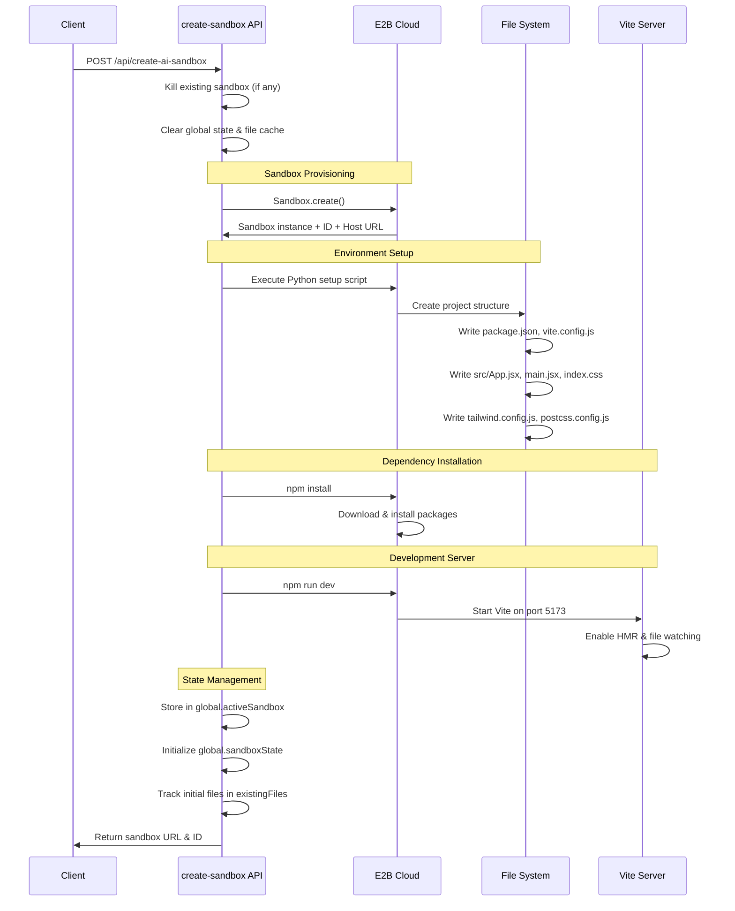
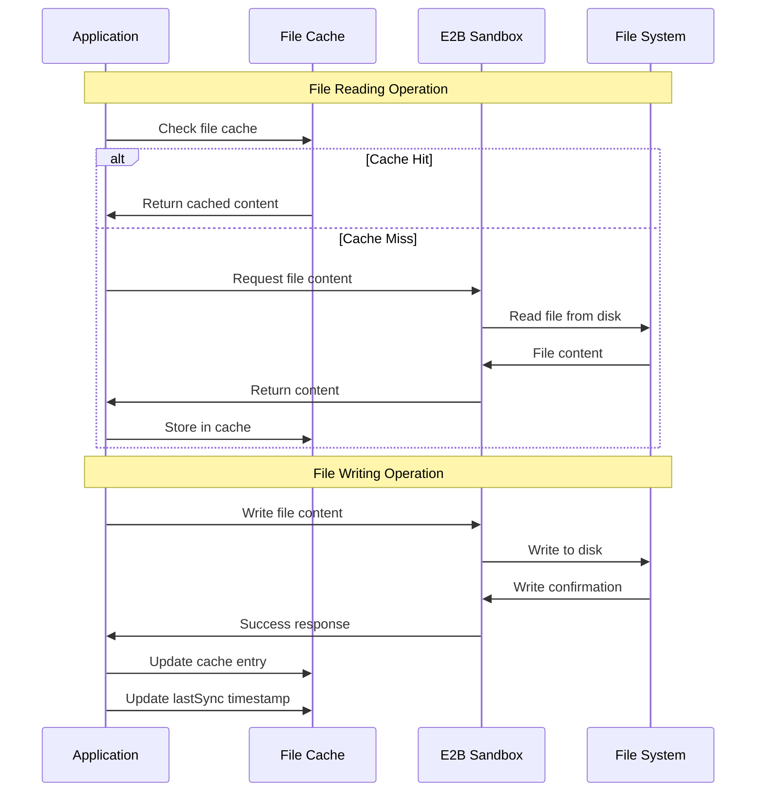
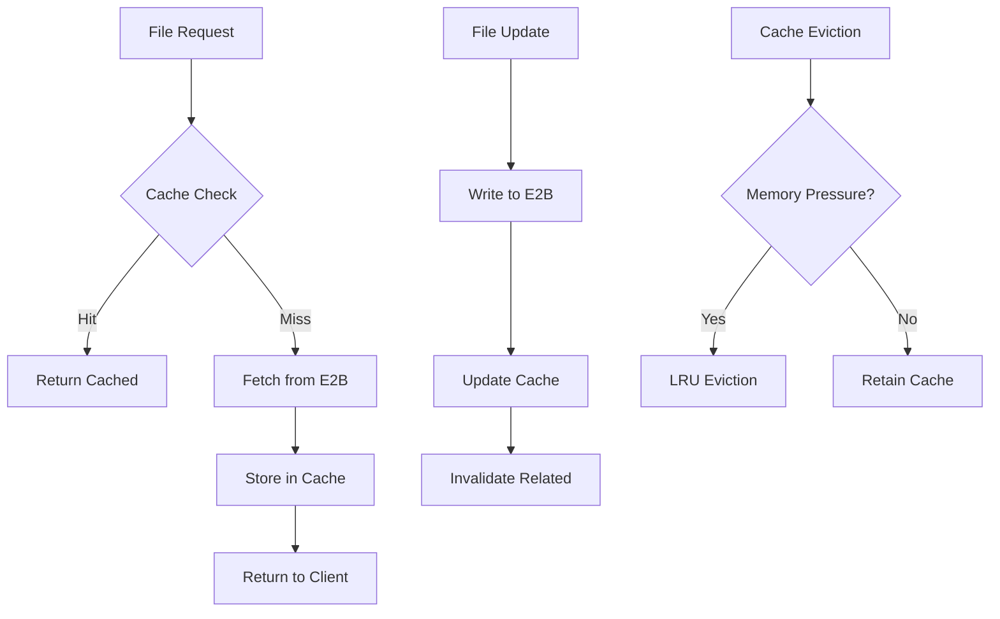
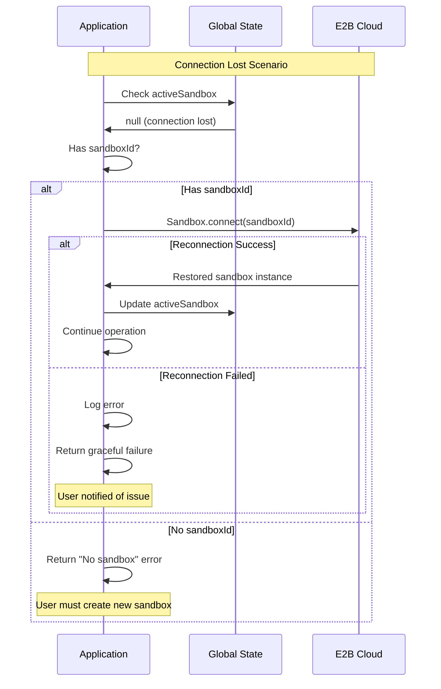
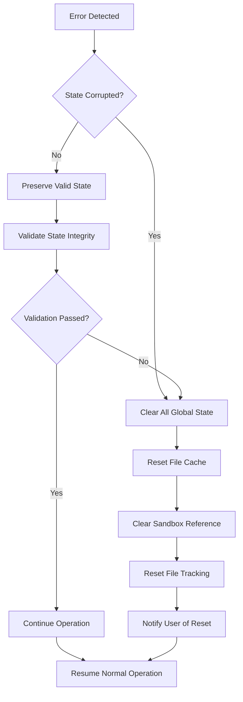

# SANDBOX.md

This document provides a comprehensive analysis of the sandboxing system used by the Open Lovable AI Code Generation Platform, including detailed diagrams and architecture documentation.

## Table of Contents

- [Overview](#overview)
- [E2B Integration Architecture](#e2b-integration-architecture)
- [Sandbox Lifecycle Management](#sandbox-lifecycle-management)
- [State Management System](#state-management-system)
- [File System Operations](#file-system-operations)
- [Networking & Communication](#networking--communication)
- [Security & Isolation](#security--isolation)
- [Performance & Optimization](#performance--optimization)
- [Error Handling & Recovery](#error-handling--recovery)
- [Monitoring & Health Checks](#monitoring--health-checks)

## Overview

The platform utilizes **E2B (Environment for AI Builders)** as its core sandboxing technology to provide secure, isolated execution environments for AI-generated React applications. Each sandbox runs a complete Vite development environment with hot module replacement and real-time code execution capabilities.

### Key Components

- **E2B Cloud Infrastructure**: Containerized execution environments
- **Global State Management**: Singleton pattern for sandbox instance tracking
- **File Cache System**: In-memory file synchronization and manifest management
- **Reconnection Logic**: Automatic recovery from connection failures
- **Health Monitoring**: Real-time sandbox status tracking

## E2B Integration Architecture

```
┌─────────────────────────────────────────────────────────────┐
│                    LOCAL APPLICATION                        │
├─────────────────────────────────────────────────────────────┤
│                    API ENDPOINTS                            │
│  ┌─────────────────┐  ┌─────────────────┐  ┌─────────────┐  │
│  │ create-sandbox  │  │ apply-code      │  │ run-command │  │
│  │     route.ts    │  │   stream.ts     │  │   route.ts  │  │
│  └─────────────────┘  └─────────────────┘  └─────────────┘  │
│                           │                                │
├───────────────────────────┼────────────────────────────────┤
│                GLOBAL STATE MANAGEMENT                     │
│  ┌─────────────────┐     │     ┌─────────────────┐          │
│  │ global.         │     │     │ global.         │          │
│  │ activeSandbox   │◄────┼────►│ sandboxState    │          │
│  └─────────────────┘     │     └─────────────────┘          │
│                           │                                │
├───────────────────────────┼────────────────────────────────┤
│                    NETWORK LAYER                           │
│                           │                                │
└───────────────────────────┼────────────────────────────────┘
                            │
                            ▼
┌─────────────────────────────────────────────────────────────┐
│                     E2B CLOUD                              │
├─────────────────────────────────────────────────────────────┤
│                 SANDBOX CONTAINER                          │
│  ┌─────────────────────────────────────────────────────────┐ │
│  │           /home/user/app/                                │ │
│  │  ┌─────────────┐  ┌─────────────┐  ┌─────────────┐      │ │
│  │  │ package.json│  │ src/        │  │ public/     │      │ │
│  │  └─────────────┘  └─────────────┘  └─────────────┘      │ │
│  │  ┌─────────────┐  ┌─────────────┐  ┌─────────────┐      │ │
│  │  │ vite.config │  │ tailwind.cfg│  │ node_modules│      │ │
│  │  └─────────────┘  └─────────────┘  └─────────────┘      │ │
│  └─────────────────────────────────────────────────────────┘ │
│                                                             │
│  ┌─────────────────────────────────────────────────────────┐ │
│  │              VITE DEV SERVER                            │ │
│  │           Port 5173 (0.0.0.0)                          │ │
│  │     ┌─────────────┐    ┌─────────────┐                 │ │
│  │     │ HMR Engine  │    │ File Watcher │                │ │
│  │     └─────────────┘    └─────────────┘                 │ │
│  └─────────────────────────────────────────────────────────┘ │
│                                                             │
│  ┌─────────────────────────────────────────────────────────┐ │
│  │                 PYTHON RUNTIME                          │ │
│  │        Code Execution & File Operations                 │ │
│  └─────────────────────────────────────────────────────────┘ │
└─────────────────────────────────────────────────────────────┘
                            │
                            ▼
                    https://<sandbox-id>.e2b.app
```

### Architecture Components

**1. Local Application Layer**
- Next.js API routes handling sandbox operations
- Global state singleton for sandbox instance management
- File cache system for performance optimization

**2. E2B Cloud Layer**
- Containerized Ubuntu environment with Node.js and Python
- Persistent file system during sandbox lifetime
- Network-accessible Vite development server

**3. Communication Layer**
- HTTP/HTTPS for API calls
- WebSocket-like streaming for real-time updates
- Automatic reconnection with exponential backoff

## Sandbox Lifecycle Management

### Creation Flow



### Global State Structure

```typescript
// Global sandbox state (types/sandbox.ts)
declare global {
  var activeSandbox: any;           // E2B sandbox instance
  var sandboxState: SandboxState;   // Comprehensive state management
  var existingFiles: Set<string>;   // File tracking for duplicates
  var sandboxData: {                // Basic connection info
    sandboxId: string;
    url: string;
  };
}

interface SandboxState {
  fileCache: {
    files: Record<string, {         // Cached file contents
      content: string;
      lastModified: number;
    }>;
    lastSync: number;               // Last synchronization timestamp
    sandboxId: string;              // Associated sandbox ID
    manifest?: FileManifest;        // Parsed file structure & dependencies
  } | null;
  sandbox: any;                     // E2B instance reference
  sandboxData: {                    // Connection metadata
    sandboxId: string;
    url: string;
  } | null;
}
```

### Termination & Cleanup

```mermaid
graph TD
    A[Termination Trigger] --> B{Sandbox Active?}
    B -->|Yes| C[Call sandbox.kill()]
    B -->|No| G[Nothing to clean]
    C --> D[Clear global.activeSandbox]
    D --> E[Clear global.sandboxState]
    E --> F[Clear global.existingFiles]
    F --> G[Cleanup Complete]
    
    H[Error During Cleanup] --> I[Log Error & Continue]
    I --> G
```

## State Management System

### File Cache Management

The platform implements a sophisticated file caching system to optimize performance and maintain consistency:

```typescript
// File cache structure
interface SandboxFileCache {
  files: Record<string, SandboxFile>;    // Path -> File content + metadata
  lastSync: number;                      // Synchronization timestamp
  sandboxId: string;                     // Associated sandbox identifier
  manifest?: FileManifest;               // Parsed project structure
}

// Individual file tracking
interface SandboxFile {
  content: string;                       // Raw file content
  lastModified: number;                  // Last modification time
}
```

### File Synchronization Process



### State Persistence Strategy

```
Global State Lifecycle:
┌─────────────────┐    ┌─────────────────┐    ┌─────────────────┐
│   CREATION      │    │   OPERATION     │    │   CLEANUP       │
├─────────────────┤    ├─────────────────┤    ├─────────────────┤
│• Initialize     │───►│• File cache     │───►│• Clear globals  │
│  globals        │    │  updates        │    │• Kill sandbox   │
│• Create sandbox │    │• State sync     │    │• Reset tracking │
│• Setup cache    │    │• Health checks  │    │• Cleanup files  │
└─────────────────┘    └─────────────────┘    └─────────────────┘
```

## File System Operations

### Project Structure Initialization

The sandbox creates a complete Vite React project structure:

```
/home/user/app/
├── package.json              # Dependencies & scripts
├── vite.config.js            # E2B-optimized Vite config
├── tailwind.config.js        # Standard Tailwind setup
├── postcss.config.js         # PostCSS configuration
├── index.html                # HTML entry point
└── src/
    ├── main.jsx              # React app entry
    ├── App.jsx               # Main application component
    └── index.css             # Tailwind CSS imports
```

### File Management API Operations

**File Reading (`get-sandbox-files/route.ts`):**

```python
# Python code executed in E2B sandbox
def get_files_content(directory='/home/user/app', extensions=['.jsx', '.js', '.tsx', '.ts', '.css', '.json']):
    files_content = {}
    
    for root, dirs, files in os.walk(directory):
        # Skip unwanted directories
        dirs[:] = [d for d in dirs if d not in ['node_modules', '.git', 'dist', 'build']]
        
        for file in files:
            if any(file.endswith(ext) for ext in extensions):
                file_path = os.path.join(root, file)
                relative_path = os.path.relpath(file_path, '/home/user/app')
                
                # File size limit (10KB) to prevent memory issues
                with open(file_path, 'r') as f:
                    content = f.read()
                    if len(content) < 10000:
                        files_content[relative_path] = content
    
    return files_content
```

**File Writing (from `apply-ai-code-stream/route.ts`):**

```python
# Secure file writing with directory creation
import os
os.makedirs(os.path.dirname("${fullPath}"), exist_ok=True)
with open("${fullPath}", 'w') as f:
    f.write("""${escapedContent}""")
print(f"File written: ${fullPath}")
```

### File Tracking System

```typescript
// Track all created files to prevent duplicates
global.existingFiles = new Set<string>([
  'src/App.jsx',
  'src/main.jsx', 
  'src/index.css',
  'index.html',
  'package.json',
  'vite.config.js',
  'tailwind.config.js',
  'postcss.config.js'
]);

// Add new files when created
if (!global.existingFiles.has(normalizedPath)) {
  global.existingFiles.add(normalizedPath);
  results.filesCreated.push(normalizedPath);
}
```

## Networking & Communication

### E2B Network Architecture

```
┌─────────────────────────────────────────────────────────────┐
│                    CLIENT BROWSER                           │
│                                                             │
│  ┌─────────────────┐    ┌─────────────────┐                │
│  │   Next.js App   │    │   Preview       │                │
│  │  localhost:3000 │    │   iframe        │                │
│  └─────────────────┘    └─────────────────┘                │
│           │                       │                        │
└───────────┼───────────────────────┼────────────────────────┘
            │                       │
            ▼                       ▼
┌─────────────────────────────────────────────────────────────┐
│                  NETWORK LAYER                              │
│                                                             │
│  API Calls                     Direct HTTP Access          │
│  (Sandbox Management)          (Preview & Assets)          │
│                                                             │
└───────────┬───────────────────────┬────────────────────────┘
            │                       │
            ▼                       ▼
┌─────────────────────────────────────────────────────────────┐
│                    E2B CLOUD                               │
│                                                             │
│  ┌─────────────────┐    ┌─────────────────┐                │
│  │  Sandbox API    │    │  Vite Server    │                │
│  │  (Management)   │    │  Port 5173      │                │
│  └─────────────────┘    └─────────────────┘                │
│           │                       │                        │
│           └───────────────────────┼─────────               │
│                                   ▼                        │
│              https://<sandbox-id>.e2b.app                  │
└─────────────────────────────────────────────────────────────┘
```

### Communication Protocols

**1. Management API (REST)**
- Sandbox creation, status, file operations
- Secure authentication via E2B API keys
- Error handling with exponential backoff

**2. Development Server (HTTP)**
- Direct browser access to running application
- Hot Module Replacement (HMR) for live updates
- Static asset serving

**3. Command Execution (Python Runtime)**
- Secure shell command execution
- Real-time output streaming
- Process management and timeouts

### Network Configuration

```javascript
// Vite configuration for E2B compatibility
export default defineConfig({
  plugins: [react()],
  server: {
    host: '0.0.0.0',           // Accept external connections
    port: 5173,                // Standard Vite port
    strictPort: true,          // Fail if port unavailable
    hmr: false,                // Disable HMR for E2B stability
    allowedHosts: [            // Security: restrict access
      '.e2b.app', 
      'localhost', 
      '127.0.0.1'
    ]
  }
});
```

## Security & Isolation

### Container Security Model

```
┌─────────────────────────────────────────────────────────────┐
│                    HOST SYSTEM                              │
├─────────────────────────────────────────────────────────────┤
│                E2B ORCHESTRATION                            │
│  ┌─────────────────────────────────────────────────────────┐ │
│  │                SANDBOX CONTAINER                        │ │
│  │  ┌─────────────────────────────────────────────────────┐│ │
│  │  │            ISOLATED ENVIRONMENT                     ││ │
│  │  │                                                     ││ │
│  │  │  • Linux Container (Ubuntu-based)                  ││ │
│  │  │  • Network isolation                               ││ │
│  │  │  • File system isolation                           ││ │
│  │  │  • Process isolation                               ││ │
│  │  │  • Resource limits (CPU, Memory, Disk)            ││ │
│  │  │  • No privileged operations                       ││ │
│  │  │                                                     ││ │
│  │  │  /home/user/app/ (Project Directory)              ││ │
│  │  │  ├── Read/Write access                             ││ │
│  │  │  ├── Node.js & npm execution                       ││ │
│  │  │  └── Python runtime access                        ││ │
│  │  └─────────────────────────────────────────────────────┘│ │
│  └─────────────────────────────────────────────────────────┘ │
└─────────────────────────────────────────────────────────────┘
```

### Security Boundaries

**1. Container Isolation**
- Each sandbox runs in isolated Docker container
- No access to host file system
- Limited network access to defined endpoints
- Process and user isolation

**2. API Security**
- E2B API key authentication required
- Request rate limiting and timeouts
- Input validation and sanitization
- Command execution restrictions

**3. Network Security**
- HTTPS/TLS encryption for all communications
- Allowed hosts whitelist for Vite server
- No direct SSH or shell access
- Firewall rules restricting outbound connections

### Resource Limits

```typescript
// Sandbox configuration limits
const sandboxConfig = {
  timeoutMs: 15 * 60 * 1000,        // 15 minute lifecycle
  memoryLimit: '2GB',               // RAM allocation
  cpuLimit: '1 core',               // CPU allocation
  diskSpace: '1GB',                 // Storage limit
  networkTimeout: 30000,            // 30s network timeout
  maxProcesses: 50,                 // Process limit
  maxFiles: 1000                    // File count limit
};
```

## Performance & Optimization

### Caching Strategy



### Optimization Techniques

**1. File System Optimizations**
- In-memory file caching with LRU eviction
- Batch file operations to reduce API calls
- File size limits to prevent memory exhaustion
- Differential synchronization for large projects

**2. Network Optimizations**
- Connection pooling for E2B API calls
- Request compression and batching
- Automatic retry with exponential backoff
- Persistent connections where possible

**3. Startup Optimizations**
- Parallel dependency installation and server startup
- Pre-built base images with common dependencies
- Template-based project initialization
- Lazy loading of non-essential components

### Performance Metrics

```typescript
// Performance monitoring
interface SandboxMetrics {
  startupTime: number;              // Time to ready state
  fileOperationLatency: number;     // Average file I/O time
  cacheHitRatio: number;           // Cache efficiency
  memoryUsage: number;             // RAM consumption
  networkLatency: number;          // E2B API response time
  errorRate: number;               // Failure percentage
}
```

## Error Handling & Recovery

### Reconnection Logic



### Error Recovery Strategies

**1. Automatic Reconnection**

```typescript
// From apply-ai-code-stream/route.ts:302-345
if (!sandbox && sandboxId) {
  console.log(`Sandbox ${sandboxId} not in this instance, attempting reconnect...`);
  
  try {
    // Reconnect using E2B's connect method
    sandbox = await Sandbox.connect(sandboxId, { apiKey: process.env.E2B_API_KEY });
    console.log(`Successfully reconnected to sandbox ${sandboxId}`);
    
    // Restore global state
    global.activeSandbox = sandbox;
    global.sandboxData = { sandboxId, url: `https://${host}` };
    
  } catch (reconnectError) {
    // Graceful failure with user notification
    return NextResponse.json({
      success: false,
      error: `Failed to reconnect to sandbox ${sandboxId}. May have expired.`,
      results: { filesCreated: [], packagesInstalled: [], errors: [] }
    });
  }
}
```

**2. Graceful Degradation**

```typescript
// Service degradation patterns
const errorHandlingFlow = {
  'SANDBOX_NOT_FOUND': () => {
    // Suggest creating new sandbox
    return { action: 'CREATE_NEW', message: 'Previous sandbox expired' };
  },
  'NETWORK_ERROR': () => {
    // Retry with backoff
    return { action: 'RETRY', backoff: 'exponential' };
  },
  'RESOURCE_EXHAUSTED': () => {
    // Clear cache and retry
    return { action: 'CLEAR_CACHE_RETRY' };
  },
  'PERMISSION_DENIED': () => {
    // Check API key validity
    return { action: 'CHECK_AUTH', message: 'API key may be invalid' };
  }
};
```

**3. State Consistency**



## Monitoring & Health Checks

### Health Check System

**Health Check API (`sandbox-status/route.ts`):**

```typescript
export async function GET() {
  const sandboxExists = !!global.activeSandbox;
  
  let sandboxHealthy = false;
  let sandboxInfo = null;
  
  if (sandboxExists && global.activeSandbox) {
    try {
      // Basic existence check (E2B handles internal health)
      sandboxHealthy = true;
      sandboxInfo = {
        sandboxId: global.sandboxData?.sandboxId,
        url: global.sandboxData?.url,
        filesTracked: Array.from(global.existingFiles || []),
        lastHealthCheck: new Date().toISOString()
      };
    } catch (error) {
      sandboxHealthy = false;
    }
  }
  
  return NextResponse.json({
    success: true,
    active: sandboxExists,
    healthy: sandboxHealthy,
    sandboxData: sandboxInfo
  });
}
```

### Monitoring Dashboard

```
┌─────────────────────────────────────────────────────────────┐
│                  SANDBOX MONITORING                        │
├─────────────────────────────────────────────────────────────┤
│  Status: ●ACTIVE    │  Uptime: 14:32:11  │  Health: ●GOOD │
│  ID: sb_abc123...   │  URL: https://...   │  Files: 12     │
├─────────────────────────────────────────────────────────────┤
│                        METRICS                             │
│  ┌─────────────────┐ ┌─────────────────┐ ┌─────────────────┐│
│  │   File Cache    │ │   Network       │ │   Resources     ││
│  │   Hit: 89%      │ │   Latency: 45ms │ │   Memory: 234MB ││
│  │   Size: 2.3MB   │ │   Errors: 0     │ │   CPU: 12%      ││
│  └─────────────────┘ └─────────────────┘ └─────────────────┘│
├─────────────────────────────────────────────────────────────┤
│                      RECENT ACTIVITY                       │
│  14:35 - File created: src/components/Header.jsx           │
│  14:34 - Package installed: react-icons                    │
│  14:33 - Command executed: npm run build                   │
│  14:32 - Sandbox health check: PASSED                      │
└─────────────────────────────────────────────────────────────┘
```

### Alerting & Notifications

```typescript
// Monitoring thresholds and alerts
const monitoringConfig = {
  healthCheckInterval: 30000,       // 30 seconds
  alertThresholds: {
    memoryUsage: 0.8,              // 80% memory usage
    errorRate: 0.1,                // 10% error rate
    responseTime: 5000,            // 5 second response time
    cacheHitRatio: 0.5             // 50% cache hit ratio
  },
  
  alertActions: {
    HIGH_MEMORY: 'clearCache',
    HIGH_ERROR_RATE: 'restartSandbox',
    SLOW_RESPONSE: 'checkNetwork',
    LOW_CACHE_HIT: 'optimizeCache'
  }
};
```

## Advanced Features

### File Manifest Generation

The system automatically generates comprehensive file manifests for intelligent code understanding:

```typescript
// Automated manifest creation
interface FileManifest {
  files: Record<string, FileInfo>;        // All project files with metadata
  routes: RouteInfo[];                    // Detected routing structure
  componentTree: ComponentTree;           // Import/export relationships
  entryPoint: string;                     // Main application entry
  styleFiles: string[];                   // CSS/styling files
  timestamp: number;                      // Last analysis time
}

// Real-time file analysis
for (const [relativePath, content] of Object.entries(files)) {
  const fileInfo: FileInfo = {
    content: content as string,
    type: detectFileType(relativePath),
    path: fullPath,
    relativePath,
    lastModified: Date.now(),
  };
  
  // Parse JavaScript/JSX files for components and imports
  if (relativePath.match(/\.(jsx?|tsx?)$/)) {
    const parseResult = parseJavaScriptFile(content, fullPath);
    Object.assign(fileInfo, parseResult);
  }
  
  fileManifest.files[fullPath] = fileInfo;
}
```

### Intelligent Package Management

```typescript
// Automatic package detection and installation
const packageDetectionSources = [
  'importStatements',      // import { Icon } from 'react-icons/fi'
  'xmlTags',              // <package>react-router-dom</package>  
  'requireStatements',    // const express = require('express')
  'dynamicImports'        // import('./component.jsx')
];

// Smart installation with conflict resolution
const installationStrategy = {
  deduplication: true,           // Remove duplicate packages
  peerDependencyResolution: '--legacy-peer-deps',
  packageVersioning: 'latest',   // Use latest stable versions
  installTimeout: 120000,        // 2 minute timeout
  retryPolicy: 'exponential'     // Retry failed installations
};
```

This comprehensive sandboxing system provides a secure, performant, and reliable foundation for AI-powered code generation and execution, with sophisticated error handling, monitoring, and optimization capabilities.